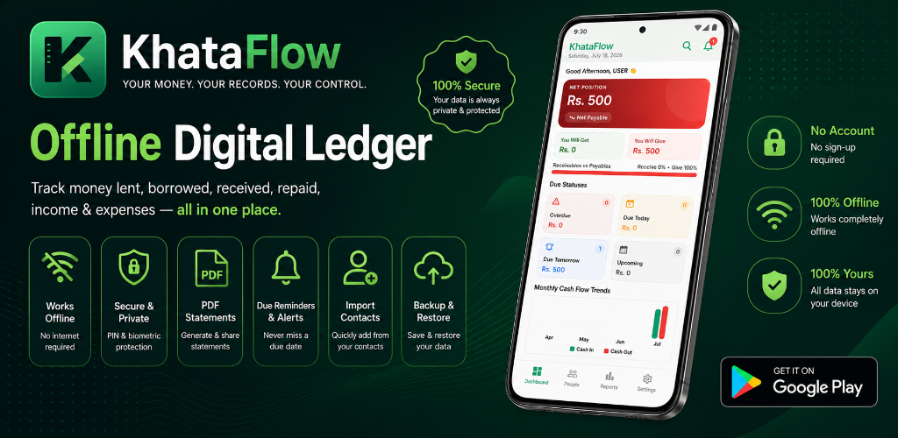
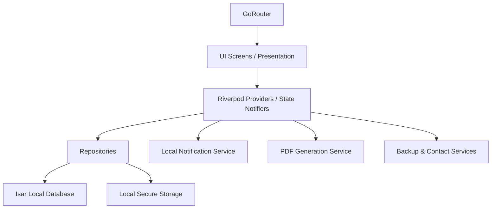

# KhataFlow v1.0.3+5



[](#)
[](#)
[](#)
[](#)
[](#)
[](#)
[](#)
[](LICENSE)


**KhataFlow** is a secure, offline-first personal ledger and expense bookkeeping manager built with Flutter. It helps individuals, freelancers, and small businesses track transactions, manage debts/credits, generate PDF statements, and set automated reminders—all without requiring an active internet connection.

---

## 📱 Features

- **Biometric & PIN Lock Screen**: Fast, secure fingerprint/face recognition and 4-digit PIN access powered by local hardware-backed storage (SHA-256 salted hashes).
- **Offline-First Storage**: Local database operations using high-performance [Isar](https://isar.dev/) queries optimized for speed and large datasets (>50,000 transactions).
- **Local Backup & Restore**: Securely export your entire ledger database to a local file and restore it seamlessly on any device.
- **Device Contact Integration**: Seamlessly import names and phone numbers directly from your phone's address book to quickly build ledger entries.
- **Statement Generation & Sharing**: Create professionally formatted PDF ledger statements with running balance logs, status cards, and direct sharing options.
- **Ledger Reminders & Notifications**: Set up local notifications and reminders to ensure timely updates and reviews.
- **Trash Bin Recovery**: Safe deletion framework supporting soft-deletes and automatic 30-day purge management.
- **Interactive Analytics**: Premium dashboard plotting monthly cash flow ratios and net ledger position charts using `fl_chart`.

---

## 🏗️ Architecture Diagram



---

## 🛠️ Technology Stack

- **Framework**: [Flutter](https://flutter.dev) (Dart)
- **State Management**: [Riverpod](https://riverpod.dev) (Auto-generated providers, async state tracking)
- **Local Database**: [Isar Database](https://isar.dev)
- **Local Notifications**: `flutter_local_notifications`
- **PDF & Share**: `pdf`, `share_plus`, `url_launcher`
- **Contacts**: `flutter_contacts` (Device address book integration)
- **Storage & Files**: `file_picker`, `path_provider`, `flutter_secure_storage`
- **Routing**: [GoRouter](https://pub.dev/packages/go_router)
- **Charts**: `fl_chart`
- **Fonts**: `google_fonts` (Inter)


---

## 📂 Project Architecture

```
lib/
├── core/                        # Shared configurations and services
│   ├── database/                # Isar Service setup and initialization
│   ├── errors/                  # App exceptions and error handling
│   ├── presentation/            # Shared base widgets (offline banner, etc.)
│   ├── router/                  # GoRouter router declaration
│   └── services/                # Notification, security, and purge services
└── features/                    # Modular feature directories
    ├── auth/                    # PIN/Biometric lock and unlock screens
    ├── dashboard/               # Main overview and balance widgets
    ├── khata/                   # Ledger accounts CRUD and details
    ├── notifications/           # Reminders and alert schedules
    ├── onboarding/              # Welcome screens and initial profile creation
    ├── people/                  # Customer/contacts directory
    ├── reports/                 # PDF ledger statements and generator
    ├── settings/                # App preferences and configurations
    ├── transactions/            # Add, edit, filter, and detail transactions
    └── trash/                   # Soft-delete recovery screen
```

---

## 🚀 Getting Started

### Prerequisites
- **Flutter SDK**: `^3.22.0`
- **Dart SDK**: `^3.4.0`
- **Java**: JDK 17
- **Android Studio** or **VS Code** with Flutter extensions installed

### Installation

1. **Clone the repository**:
   ```bash
   git clone https://github.com/codrix-dev/khata_app.git
   cd khata_app
   ```

2. **Sync packages**:
   ```bash
   flutter pub get
   ```

3. **Generate dynamic models code (Isar & Riverpod schemas)**:
   ```bash
   dart run build_runner build --delete-conflicting-outputs
   ```

4. **Run the application**:
   - For Android (emulator or physical device):
     ```bash
     flutter run
     ```

---

## 🗓️ Future Roadmap

- [ ] Multi-currency conversion tools with offline rate cache.
- [ ] Automated SMS/WhatsApp due alerts trigger templates.
- [ ] Desktop release support (Windows / macOS).
- [ ] Cloud sync backup via custom WebDAV or Google Drive API.

---

## 🤝 Contributing

We welcome community contributions! Please read our [Contribution Guidelines](CONTRIBUTING.md) to learn how to open issues, submit pull requests, and maintain clean commit conventions.

---

## ⚠️ Known Limitations

- Multi-device syncing is not natively supported since data is held 100% offline.
- Face Unlock on certain low-end devices may fall back to PIN authentication due to Android biometrics level classifications.

---

## 📜 Version History

- **v1.0.3** (Current): Final production-ready release with unified confirmation dialogs, cached search queries, haptic triggers, PDF export history tracking, and build metadata.
- **v1.0.2**: Shimmer loaders, custom snackbars, settings metadata, dialogs, and widget tests alignment.
- **v1.0.1**: Google Fonts (Inter) layout, Cash Flow analytics charts, timeline swipe actions, storage metrics, and advanced search.
- **v1.0.0**: Initial Release (PIN authentication, Isar storage, PDF reports generator, notifications).


---

## 📝 License

This project is licensed under the MIT License - see the [LICENSE](LICENSE) file for details.
