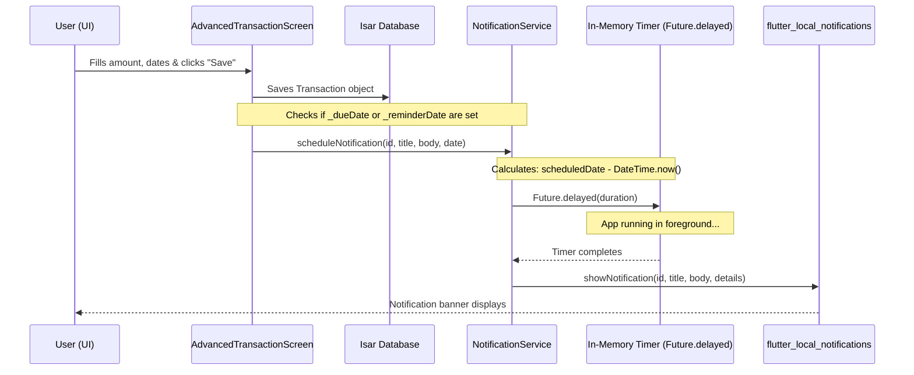

# KhataFlow Notification System Audit Report

This document presents a comprehensive audit of the notification system in the KhataFlow mobile application. 

---

## 1. Notification Flow

The lifecycle of a reminder/due-date notification currently functions as follows:



### Lifecycle Breakdown:
1. **User Creates Transaction**: Done via [AdvancedTransactionScreen](file:///d:/Flutter Project/khata_app/lib/features/transactions/presentation/screens/advanced_transaction_screen.dart).
2. **Due Date / Reminder Selected**: Date/Time pickers populate the states `_dueDate` and `_reminderDate`.
3. **Notification Scheduling Called**: During `_save()`, if the dates are non-null, `NotificationService().scheduleNotification()` is invoked with a generated ID (using `tx.uuid.hashCode`).
4. **Notification Stored**: The notification is **not stored** anywhere persistent. It is kept as an active Dart `Future.delayed` timer referencing a closure.
5. **Notification Fired**: When the timer fires, it calls `showNotification()`, which triggers the `flutter_local_notifications` native immediate display.

---

## 2. Notification Service Usage

[NotificationService](file:///d:/Flutter Project/khata_app/lib/core/services/notification_service.dart) is utilized across the codebase in the following locations:

### Files & Methods
*   **[notification_service.dart](file:///d:/Flutter Project/khata_app/lib/core/services/notification_service.dart)**:
    *   Defines `initialize()`, `requestPermissions()`, `showNotification()`, and `scheduleNotification()`.
*   **[main.dart](file:///d:/Flutter Project/khata_app/lib/main.dart)**:
    *   Calls `await NotificationService().initialize()` inside the `main()` method during app boot.
*   **[advanced_transaction_screen.dart](file:///d:/Flutter Project/khata_app/lib/features/transactions/presentation/screens/advanced_transaction_screen.dart)**:
    *   Invokes `NotificationService().scheduleNotification()` twice (once for Due Date, once for Reminder Date) during transaction execution.
*   **[notification_service_test.dart](file:///d:/Flutter Project/khata_app/test/unit/notification_service_test.dart)**:
    *   Mocks `NotificationService` for testing.

### Call Hierarchy

```
main() [main.dart]
  └── NotificationService().initialize()
  
AdvancedTransactionScreen._save() [advanced_transaction_screen.dart]
  ├── NotificationService().scheduleNotification() [Due Date]
  └── NotificationService().scheduleNotification() [Reminder Date]
        └── Future.delayed() -> showNotification() -> FlutterLocalNotificationsPlugin.show()
```

---

## 3. Scheduling Mechanism

*   **How reminders are scheduled**: Using standard Dart `Future.delayed()` asynchronous timers.
*   **Is `scheduleNotification()` called?**: Yes, it is called when a user saves a transaction containing a due date or reminder date.
*   **When is it called?**:
    *   **Transaction Creation**: Yes, inside `_save()`.
    *   **Transaction Update**: **No**. Rescheduling is not implemented during transaction edits/updates.
    *   **App Startup**: **No**. Active reminders/notifications are not registered or synchronized when the app boots.

---

## 4. Current Limitations & Survival Matrix

| State / Event | Survival Status | Reason |
| :--- | :---: | :--- |
| **App Foreground** | ✅ **Yes** | The Dart runtime is active and timers resolve normally. |
| **App Background** | ⚠️ **Partial / No** | Timers may trigger if the background state is short, but mobile OSs (Android/iOS) suspend Dart execution threads in the background to save battery, freezing/killing the timer. |
| **App Termination** | ❌ **No** | The Dart process is killed. In-memory `Future.delayed` timers are destroyed instantly. |
| **Device Reboot** | ❌ **No** | Timers are cleared; there is no persistent OS alarm registration or boot receiver to reschedule them. |
| **App Update** | ❌ **No** | The app process restarts, clearing the in-memory timers. |
| **Device Sleep / Doze** | ❌ **No** | Android Doze mode and iOS sleep modes pause background executions and timers. |

---

## 5. Pending Notification Inspection

*   **Does `flutter_local_notifications` store pending notifications?**
    *   **No**. The app does not schedule notifications through the plugin's native API (`zonedSchedule`). It only invokes immediate `show` calls via `Future.delayed`.
*   **Pending notification count**: `0`
*   **List of scheduled notifications**: Empty.

---

## 6. Android Configuration Audit

A review of [AndroidManifest.xml](file:///d:/Flutter Project/khata_app/android/app/src/main/AndroidManifest.xml) yields the following results:

### Permissions Status
*   `POST_NOTIFICATIONS` (Android 13+): ❌ **Missing**
*   `SCHEDULE_EXACT_ALARM`: ❌ **Missing**
*   `RECEIVE_BOOT_COMPLETED`: ❌ **Missing**

### Channels, Importance & Priority
*   **Channels**: The channel `'khataflow_main_channel'` is hardcoded dynamically in code, but the required receiver registration is missing in the manifest.
*   **Importance**: Set to `Importance.max`.
*   **Priority**: Set to `Priority.high`.

---

## 7. Package Audit

An audit of the dependencies registered in [pubspec.yaml](file:///d:/Flutter Project/khata_app/pubspec.yaml) shows:

*   `flutter_local_notifications`: ^17.0.0 (Installed ✅)
*   `timezone`: ❌ **Not Installed** (Required for native timezone-based `zonedSchedule`)
*   `workmanager`: ❌ **Not Installed**
*   `android_alarm_manager_plus`: ❌ **Not Installed**

---

## 8. Root Cause Analysis

The notifications failed to fire during testing due to three distinct issues:

1.  **Non-Persistent Scheduling**: The scheduler relies entirely on ephemeral Dart `Future.delayed` timers instead of using the OS's native alarm/notification queue. 
2.  **Missing Android Permissions**: The system cannot display notifications or register exact alarms because `POST_NOTIFICATIONS` and `SCHEDULE_EXACT_ALARM` permissions are completely absent from the Android manifest.
3.  **Missing Native Receiver Declarations**: The plugin requires specific receivers (e.g., `ScheduledNotificationReceiver`, `ScheduledNotificationBootReceiver`) declared inside the `<application>` block of the manifest, which are missing.

---

## 9. Recommended Fix

To achieve production-grade, reliable notifications, the minimum required changes are:

1.  **Add permissions & receivers** to `AndroidManifest.xml`.
2.  **Install `timezone`** in `pubspec.yaml` and initialize timezone data in `main.dart`.
3.  **Refactor `scheduleNotification`** to use native `zonedSchedule` from `flutter_local_notifications` instead of `Future.delayed`.
4.  **Reschedule reminders** on transaction updates or app startup.

### Estimated Implementation Effort
*   **Effort**: Low-Medium (~1 to 2 hours of development and testing time)
